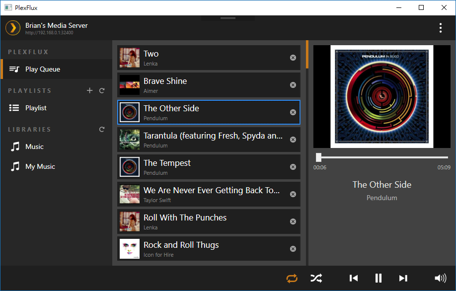
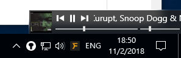

# PlexFlux
A music streaming player for Plex media server

  

## Download
[Download from Github](https://github.com/brian9206/PlexFlux/releases/latest)

### System Requirement
* Windows 7 or above
* Desktop Experience must be enabled for Windows Server
* .NET Framework 4.6.1 Full installed
* Internet connection

## Features
- Play Queue which is easy to manage
- Upcoming list like iTunes
- Manipulating playlist on server
- DeskBand for playback control
- Mini playback control when minimized to system tray

## Motivation
Plex media server is one of the best (?) media server in the market. However, their official desktop client (and Windows 10 app) is a piece of shit for playing music. You cannot manage the play queue well with both of their web and desktop client. Therefore, their client will not be my usual music player.

## Credits
- Arcanemagus: [his discovery of Plex API](https://github.com/Arcanemagus/plex-api/wiki)
