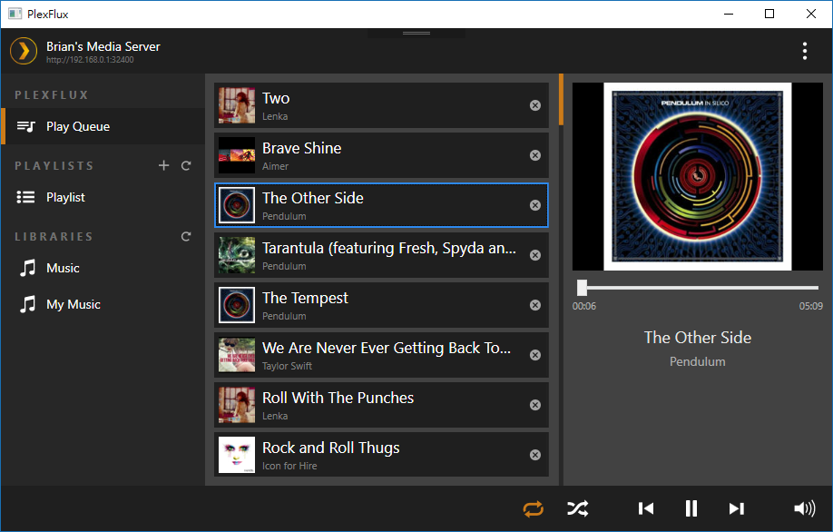

# PlexFlux
A music streaming player for Plex media server

## Features
- Play Queue which is easy to manage
- Upcoming list like iTunes
- Manipulating playlist on server
- DeskBand for playback control

## Motivation
Plex media server is one of the best (?) media server in the market. However, their official desktop client (and Windows 10 app) is a piece of shit for playing music. You cannot manage the play queue well with both of their web and desktop client. Therefore, their client will not be my usual music player.

## Credits
- Arcanemagus: [his discovery of Plex API](https://github.com/Arcanemagus/plex-api/wiki)
